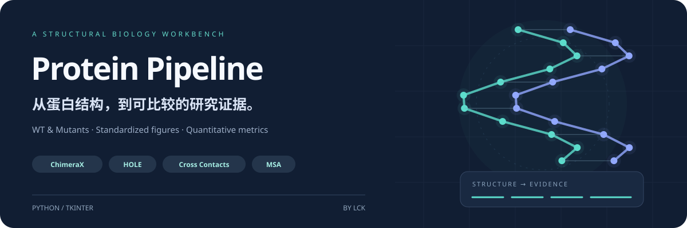
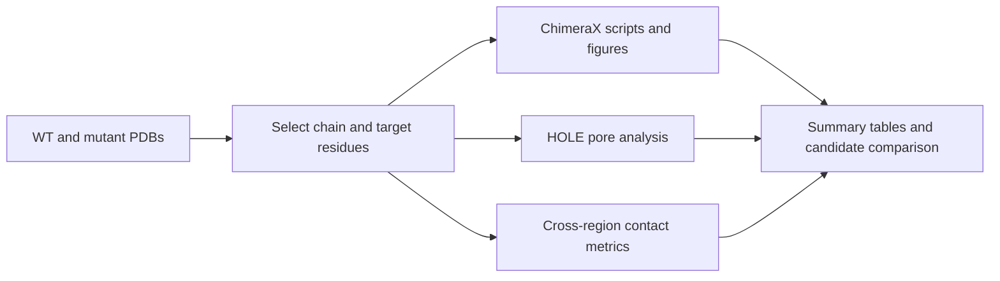

<div align="center">



# Protein Pipeline

**WT and mutant comparison · Standardized figures · Pore analysis · Quantitative summaries**

A GUI-driven workflow for reproducible structural analysis of wild-type and mutant proteins.

   [](LICENSE)

[Features](#features) · [Quick start](#quick-start) · [Output files](#output-files) · [Methods](docs/METHODS.md) · [Report an issue](https://github.com/kkkklck/Protein-processor/issues)

</div>

---

Turn **WT and mutant PDB models** into comparable structural figures, contact metrics, and summary tables. Protein Pipeline reduces repeated setup and helps organize candidates for experimental follow-up. Originally developed for ion-channel research, it also supports other proteins with consistent chain identifiers and residue numbering. The HOLE module is intended for pore structures.

## Features

| Module | What it does | Main outputs |
| :--- | :--- | :--- |
| **ChimeraX visualization** | Generates consistently configured electrostatic surfaces, site-contact views, SASA, and hydrogen-bond analysis scripts | `.cxc` scripts, structural figures, analysis logs |
| **HOLE pore analysis** | Runs pore-radius calculations through WSL to compare narrow regions and radius profiles | Pore profiles, minimum-radius tables |
| **Cross-region contacts** | Calculates contact counts, density, minimum distance, and cutoff scans between two residue sets | Contact summaries and distance metrics |
| **Aggregation and scoring** | Combines structural results and exports tables for candidate comparison and reporting | `metrics_all.csv`, `stage3_table.csv` |
| **Mutant construction** | Generates ChimeraX `swapaa` scripts for point mutations | Mutation scripts and models after execution |
| **MSA candidates** | Runs Clustal Omega and identifies candidate substitutions from majority consensus | Alignment views and candidate tables |

## Workflow



## Quick start

### 1. Prepare your environment

Use **Python 3.10+**; Windows is recommended. The source uses union type annotations such as `str | None`.

```bash
git clone https://github.com/kkkklck/Protein-processor.git
cd Protein-processor
python -m pip install numpy pandas matplotlib biopython
```

Tkinter is usually included with Python on Windows. Configure external tools for the modules you plan to use:

| Tool | Purpose | Required for |
| :--- | :--- | :--- |
| UCSF ChimeraX | Executes `.cxc` scripts, generates figures, and runs `swapaa` | Visualization and mutant construction |
| WSL + HOLE | Calculates pore-radius profiles | HOLE analysis |
| WSL + Clustal Omega | Performs multiple sequence alignment | MSA analysis |

Adjust the HOLE and Clustal Omega WSL settings near the beginning of [PP.py](PP.py) for your machine. Use the GUI's environment diagnostics to check your configuration.

### 2. Launch the workbench

```bash
python "graphic（PP）.py"
```

1. Select a **WT PDB** and add mutant models as needed.
2. Open research mode and set the chain ID, target residues, and output directory.
3. Select analysis options, generate `.cxc` scripts, and execute them in ChimeraX.
4. Add **HOLE** or cross-region contact analysis where relevant.
5. Aggregate outputs in the summary and scoring tab and export comparison tables.

**Prepare comparable inputs:** use consistent residue numbering and chain identifiers across models. Check the mapping between alignment positions and PDB residue numbers before interpreting differences.

## Output files

Each file is generated by its corresponding module. Availability depends on selected options and successful execution.

| File | Contents |
| :--- | :--- |
| `hole_min_table.csv` | Minimum pore radius and associated position for each model |
| `hole_min_summary.csv` | Compact pore-analysis summary |
| `contacts_cross_summary.csv` | Contact statistics between two residue sets |
| `metrics_all.csv` | Aggregated quantitative metrics |
| `metrics_scored.csv` | Scores calculated using configured rules |
| `stage3_table.csv` | Summary table for comparison and reporting |

<details>
<summary><strong>What if contact counts are identical?</strong></summary>

Small residue sets and overly strict or permissive cutoffs can limit discrimination. Compare `CrossContactMinDist`, the `Pairs@…` cutoff scan, and Top-K distance metrics alongside structural figures. See [Methods](docs/METHODS.md) for definitions and interpretation.

</details>

<details>
<summary><strong>Troubleshooting</strong></summary>

| Symptom | Check first |
| :--- | :--- |
| Residue not found | PDB numbering, chain ID, and residue expression |
| HOLE or WSL execution fails | WSL availability, Conda initialization path, environment name, and HOLE command |
| MSA fails | WSL `clustalo` path, FASTA input, and reference sequence name |
| Summary columns are missing | Whether the relevant module ran and whether logs and output directories are complete |

The built-in manual, log window, and output preview provide additional diagnostic information.

</details>

## Repository layout

```text
Protein-processor/
├── graphic（PP）.py        # Tkinter GUI entry point
├── PP.py                  # Scripts, pore analysis, metrics, and aggregation
├── msa_consensus_tool.py   # Consensus analysis and candidate substitutions
├── help_texts.py           # Built-in manual
├── log_center.py           # Logging
├── delet_PP.py             # File cleanup utility
└── docs/                  # Homepage artwork and methods
```

## Methods and citation

Structural metrics support candidate comparison and mechanistic hypotheses; functional effects require suitable experimental validation. Interpret pore geometry, electrostatics, and contacts together with input-model quality. Configured scores should also be assessed against their underlying rules.

For research use, record the project version, model provenance, residue sets, and analysis parameters. Cite the ChimeraX, HOLE, and structure-prediction tools actually used. See [Methods](docs/METHODS.md) for further guidance.

## License and contributions

Released under the [MIT License](LICENSE). Questions, bug reports, and improvement suggestions are welcome through [Issues](https://github.com/kkkklck/Protein-processor/issues).

<div align="center">

<sub>Built by LCK · From structures to testable hypotheses.</sub>

</div>
