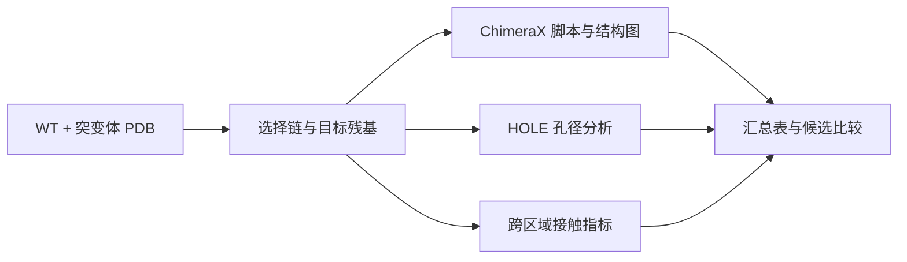

<div align="center">


# Protein Pipeline · 蛋白结构分析工作台

**WT 与突变体对比 · 标准化出图 · 孔径分析 · 定量指标汇总**

A GUI-driven workflow for reproducible structure analysis of wild-type and mutant proteins.

   [](LICENSE)

[功能概览](#功能概览) · [快速开始](#快速开始) · [结果文件](#结果文件) · [方法说明](docs/METHODS.md) · [问题反馈](https://github.com/kkkklck/Protein-processor/issues)

</div>

---

把 **WT / 突变体 PDB 模型** 转成一套可比较的结构图、接触指标和汇总表，减少重复配置，方便整理候选突变与后续实验假设。项目源于离子通道研究，也可用于链编号与残基编号一致的其他蛋白模型；HOLE 模块主要用于孔道结构。

## 功能概览

| 模块 | 可以做什么 | 主要产物 |
| :--- | :--- | :--- |
| **ChimeraX 出图** | 为 WT 与突变体生成统一配置的静电表面、位点接触、SASA 与氢键分析脚本 | `.cxc` 脚本、结构图、分析日志 |
| **HOLE 孔径分析** | 通过 WSL 批量计算孔道半径，比较最窄位置与孔径轮廓 | 孔径曲线、最小半径表 |
| **跨区域接触** | 对两个残基集合计算接触数量、密度、最小距离及 cutoff 扫描 | 接触汇总、距离指标 |
| **汇总与评分** | 合并结构分析结果，整理候选模型，导出用于比较与报告的表格 | `metrics_all.csv`、`stage3_table.csv` |
| **突变体构建** | 生成 ChimeraX `swapaa` 点突变脚本 | 突变脚本与执行后的模型 |
| **MSA 候选位点** | 调用 Clustal Omega，并根据多数派共识整理候选突变 | 对齐视图、候选位点表 |

## 工作流程



## 快速开始

### 1. 准备环境

使用 **Python 3.10+**，推荐 Windows 环境。当前源码使用 `str | None` 等类型注解，因此旧版 README 中的 Python 3.9 要求已调整。

```bash
git clone https://github.com/kkkklck/Protein-processor.git
cd Protein-processor
python -m pip install numpy pandas matplotlib biopython
```

Tkinter 通常随 Windows Python 安装提供。按需要配置以下外部工具：

| 工具 | 用途 | 什么时候需要 |
| :--- | :--- | :--- |
| UCSF ChimeraX | 执行 `.cxc`、生成结构图、执行 `swapaa` | 出图与突变体构建 |
| WSL + HOLE | 孔径计算 | 使用 HOLE 模块时 |
| WSL + Clustal Omega | 多序列比对 | 使用 MSA 模块时 |

HOLE 与 Clustal Omega 的 WSL 路径配置位于 [PP.py](PP.py) 开头；请按本机环境调整。可在 GUI 内使用环境检测入口检查配置。

### 2. 打开工作台

```bash
python "graphic（PP）.py"
```

1. 选择 **WT PDB**，按需添加突变体模型。
2. 进入“研究”模式，设置链 ID、目标残基与输出目录。
3. 选择所需分析项，生成 `.cxc`，再在 ChimeraX 中执行。
4. 按需使用 **HOLE** 或跨区域接触分析补充指标。
5. 在“汇总 & 评分”页整理输出，导出比较表。

**输入准备：**各模型应使用一致的残基编号和链标识。序列比对中的位点与 PDB 编号也需要核对，避免把编号差异当成结构差异。

## 结果文件

以下文件由对应模块生成，具体内容取决于选项和执行结果。

| 文件 | 内容 |
| :--- | :--- |
| `hole_min_table.csv` | 各模型的最小孔径及相关位置 |
| `hole_min_summary.csv` | 孔径分析简表 |
| `contacts_cross_summary.csv` | 两个残基集合的接触统计 |
| `metrics_all.csv` | 合并后的定量指标 |
| `metrics_scored.csv` | 按配置规则计算的评分 |
| `stage3_table.csv` | 用于比较与报告的汇总表 |

<details>
<summary><strong>接触数量相同时，怎么继续比较？</strong></summary>

残基集合很小、cutoff 过严或过宽，都可能让接触数量失去区分度。结合 `CrossContactMinDist`、`Pairs@…` cutoff 扫描和 Top-K 距离指标查看差异，并对照结构图。完整定义见 [方法说明](docs/METHODS.md)。

</details>

<details>
<summary><strong>常见问题与排查入口</strong></summary>

| 现象 | 优先检查 |
| :--- | :--- |
| 残基找不到 | PDB 编号、链 ID、残基表达式 |
| HOLE / WSL 执行失败 | WSL 是否可用、Conda 初始化路径、环境名与 HOLE 命令 |
| MSA 无法运行 | WSL 中 `clustalo` 路径、FASTA 文件、参考序列名称 |
| 汇总缺少部分列 | 对应分析模块是否实际执行、日志与输出目录是否完整 |

GUI 内可通过使用手册、日志窗口和输出预览进一步定位问题。

</details>

## 项目结构

```text
Protein-processor/
├── graphic（PP）.py        # Tkinter GUI 入口
├── PP.py                  # 脚本生成、孔径分析、指标与汇总
├── msa_consensus_tool.py   # 共识分析与候选位点
├── help_texts.py           # 内置使用手册
├── log_center.py           # 日志管理
├── delet_PP.py             # 文件清理工具
└── docs/                  # 主页素材与方法说明
```

## 方法与引用

结构指标用于支持候选比较与机制假设，功能变化仍需相应实验验证。孔径、静电表面与接触指标应结合输入模型质量一起解读；评分本身并不等同于实验效应大小。

用于论文时，请记录本项目版本、输入模型来源、残基集合与分析参数，并引用实际使用的 ChimeraX、HOLE 和结构预测工具。详细解释见 [方法说明](docs/METHODS.md)。

## 许可与交流

本项目采用 [MIT License](LICENSE)。欢迎通过 [Issues](https://github.com/kkkklck/Protein-processor/issues) 反馈使用问题或提交改进建议。

<div align="center">

<sub>Built by LCK · From structures to testable hypotheses.</sub>

</div>
